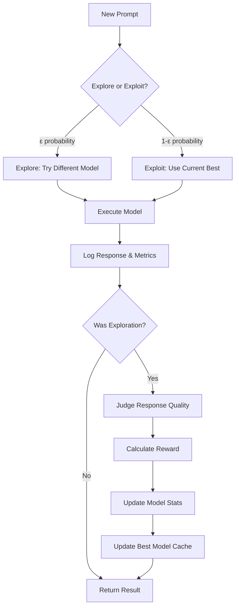

# Adaptive Cortex Complete (ACC)

**A Snowflake-native reinforcement learning system that automatically learns which LLM to use for optimal cost and performance.**

## 🎯 What is ACC?

Adaptive Cortex Complete solves a critical problem: **You don't know which LLM (Claude, Llama, Mistral, etc.) will perform best for your specific prompts, and you can't afford to manually test every combination.**

ACC uses a **multi-armed bandit algorithm** running directly in Snowflake to:
- 🤖 **Automatically route** each prompt to the optimal model
- 📊 **Learn continuously** from real usage without labeled data
- 💰 **Balance performance vs cost** with tunable weights
- ⚡ **Adapt in real-time** as models or pricing change
- 🔄 **Self-optimize** without manual intervention

## 🏗️ How It Works



### Key Components:

1. **ε-Greedy Strategy**: With probability `ε` (default 15%), explore a random model. Otherwise, use the current best.

2. **Multi-Judge Evaluation**: When exploring, other models judge the response quality (0-1 score).

3. **Reward Calculation**: Combines performance and cost efficiency:
   ```
   reward = (perf_weight × performance) + ((1 - perf_weight) × cost_efficiency)
   ```

4. **EWMA Learning**: Exponentially weighted moving averages update model statistics for quick adaptation.

5. **Cached Best Model**: Zero-latency exploitation using pre-computed optimal model.

## 🚀 Quick Start

### Prerequisites

- Snowflake account with Cortex AI functions enabled
- Python environment with `snowflake-snowpark-python`
- Access to multiple Cortex models (Claude, Llama, Mistral, etc.)

### Step 1: Database Setup

Run the SQL setup to create all necessary tables and initialize the system:

```sql
-- Execute the entire 1.setup.sql file
-- This creates the database, schema, and all required tables
```

**What this creates:**
- `ARMS`: Available models and their costs
- `ARM_STATS`: Running performance statistics per model
- `CURRENT_BEST`: Cached optimal model for fast exploitation
- `EVENTS`: Complete log of all model calls and responses
- `JUDGE_OUTPUTS`: Quality scores from judge models
- `CONFIG`: System configuration (exploration rate, performance weight, etc.)

### Step 2: Configure Your Models

Update the `ARMS` table with your available models and costs:

```sql
INSERT OVERWRITE INTO ARMS (MODEL_ID, CREDITS_PER_MTOK, NOTE) VALUES
('claude-3-5-sonnet', 2.55, 'Claude family'),
('llama3.1-70b', 1.21, 'Llama family'),
('llama3.1-8b', 0.19, 'Llama small'),
('mistral-7b', 0.12, 'Mistral Model');
```

### Step 3: Set Up Connection

Create `connection.json` with your Snowflake credentials:

```json
{
  "account": "your-account",
  "user": "your-username", 
  "password": "your-password",
  "role": "your-role",
  "warehouse": "your-warehouse",
  "database": "ADAPTIVE_LLM_DB",
  "schema": "AI_ROUTER"
}
```

### Step 4: Run ACC on Your Data

Use the provided Jupyter notebook `2.run_acc.ipynb` or call directly:

```python
from acc import adaptive_cortex_complete_over_table
import json
from snowflake.snowpark.session import Session

# Connect to Snowflake
connection_parameters = json.load(open('connection.json'))
session = Session.builder.configs(connection_parameters).create()

# Run ACC over your table
results = adaptive_cortex_complete_over_table(
    session=session,
    base_prompt="Summarize this support ticket:",
    table_name="your_database.your_schema.support_tickets",
    col_name="ticket_description",
    limit=100  # Start small for testing
)
```

### Step 5: Visualize Results

Open `3.visualize_results.ipynb` to see:
- **Animated learning curves** showing how model performance evolves
- **Cost vs performance scatter plots**  
- **Exploration vs exploitation ratios**
- **Real-time model rankings**

## 📊 Understanding the Visualizations

### 1. Pure Performance Animation
Shows how each model's judge-scored performance improves over time as ACC learns.

### 2. Cost-Adjusted Performance Animation  
Shows the combined score that balances quality and cost efficiency - this determines the "winner."

### 3. Live Dashboard
- **Current Model Scores**: Real-time ranking of all models
- **Exploration vs Exploitation**: How often each model is chosen
- **EWMA Performance**: Smoothed performance metrics
- **Cost vs Performance Plot**: Efficiency frontier visualization

## ⚙️ Configuration Options

### Key Parameters in `CONFIG` Table:

| Parameter | Default | Description |
|-----------|---------|-------------|
| `epsilon` | 0.15 | Exploration probability (0-1). Higher = more exploration |
| `perf_weight` | 0.80 | Performance vs cost balance (0-1). Higher = prioritize quality over cost |
| `ewma_alpha` | 0.20 | Learning rate (0-1). Higher = adapt faster to new data |

### Tuning Guidelines:

- **High accuracy needs**: `perf_weight = 0.9`, `epsilon = 0.1`
- **Cost optimization**: `perf_weight = 0.3`, `epsilon = 0.2` 
- **Rapid adaptation**: `ewma_alpha = 0.3`
- **Stable environments**: `ewma_alpha = 0.1`

## 📈 Use Cases

### Customer Support
```python
adaptive_cortex_complete_over_table(
    base_prompt="Generate a helpful response to this customer inquiry:",
    table_name="support.tickets",
    col_name="customer_message"
)
```

### Content Generation
```python  
adaptive_cortex_complete_over_table(
    base_prompt="Write a compelling product description:",
    table_name="catalog.products", 
    col_name="product_specs"
)
```

### Data Analysis
```python
adaptive_cortex_complete_over_table(
    base_prompt="Analyze this sales data and provide insights:",
    table_name="analytics.monthly_reports",
    col_name="sales_summary"
)
```

## 🔧 API Reference

### Core Function

```python
adaptive_cortex_complete(session: Session, prompt: str) -> str
```

**Parameters:**
- `session`: Snowflake session object
- `prompt`: Text prompt to process

**Returns:** JSON string with `{"model": "chosen_model", "response": "model_output"}`

### Batch Processing

```python
adaptive_cortex_complete_over_table(
    session: Session,
    base_prompt: str,
    table_name: str, 
    col_name: str,
    id_col: str = None,
    limit: int = None,
    write_to_table: str = None
)
```

**Parameters:**
- `base_prompt`: Base prompt template
- `table_name`: Source table name
- `col_name`: Column containing text to process
- `id_col`: Optional ID column (auto-generated if None)
- `limit`: Optional row limit for testing
- `write_to_table`: Optional output table name

## 🧠 Advanced Features

### Custom Judge Prompts
Modify the judging logic in `evaluate_response_with_judges()` to use domain-specific evaluation criteria.

### Dynamic Model Management
Add/remove models by updating the `ARMS` table:

```sql
-- Add new model
INSERT INTO ARMS VALUES ('new-model', TRUE, 1.5, 'New model');

-- Deactivate model  
UPDATE ARMS SET IS_ACTIVE = FALSE WHERE MODEL_ID = 'old-model';
```

### Performance Monitoring
Query the system tables for insights:

```sql
-- Model performance over time
SELECT MODEL_ID, SCORE, EWMA_PERF, EWMA_COST, PULLS
FROM ARM_STATS ORDER BY SCORE DESC;

-- Recent exploration results
SELECT CHOSEN_MODEL, AVG(REWARD), COUNT(*)
FROM EVENTS 
WHERE IS_EXPLORATION = TRUE 
  AND TS > CURRENT_TIMESTAMP() - INTERVAL '1 DAY'
GROUP BY CHOSEN_MODEL;
```

## 🚨 Troubleshooting

### Common Issues:

1. **No exploration happening**: Check `epsilon` value in CONFIG table
2. **Poor model selection**: Verify model costs in ARMS table are accurate  
3. **Slow adaptation**: Increase `ewma_alpha` in CONFIG
4. **Judge evaluation errors**: Check model availability and prompt formatting

### Debug Queries:

```sql
-- Check system status
SELECT * FROM CURRENT_BEST;
SELECT * FROM ARM_STATS ORDER BY SCORE DESC;

-- View recent events
SELECT * FROM EVENTS ORDER BY TS DESC LIMIT 10;

-- Check judge outputs
SELECT * FROM JUDGE_OUTPUTS ORDER BY CREATED_AT DESC LIMIT 10;
```

## 📝 License

Apache License 2.0 - see [LICENSE](LICENSE) file for details.

## 🤝 Contributing

1. Fork the repository
2. Create a feature branch
3. Make your changes
4. Add tests if applicable
5. Submit a pull request

## 📞 Support

For questions or issues:
- Open a GitHub issue
- Check the troubleshooting section above
- Review the example notebooks for usage patterns

---

**Built with ❄️ Snowflake Cortex AI**